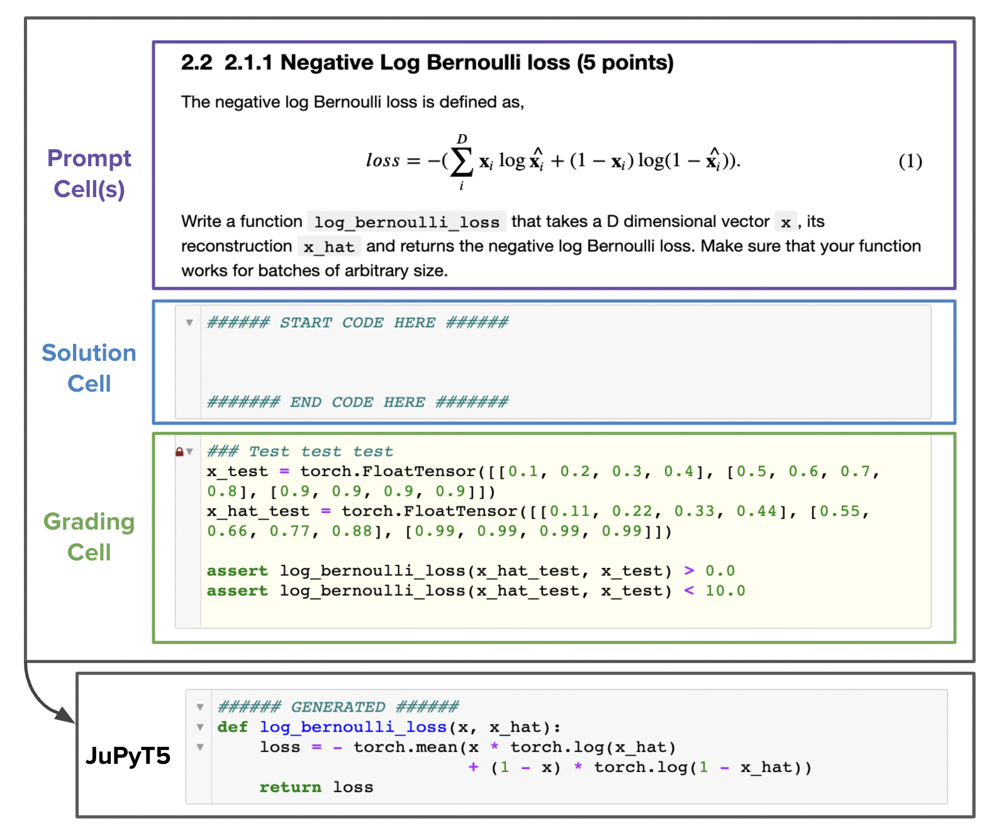
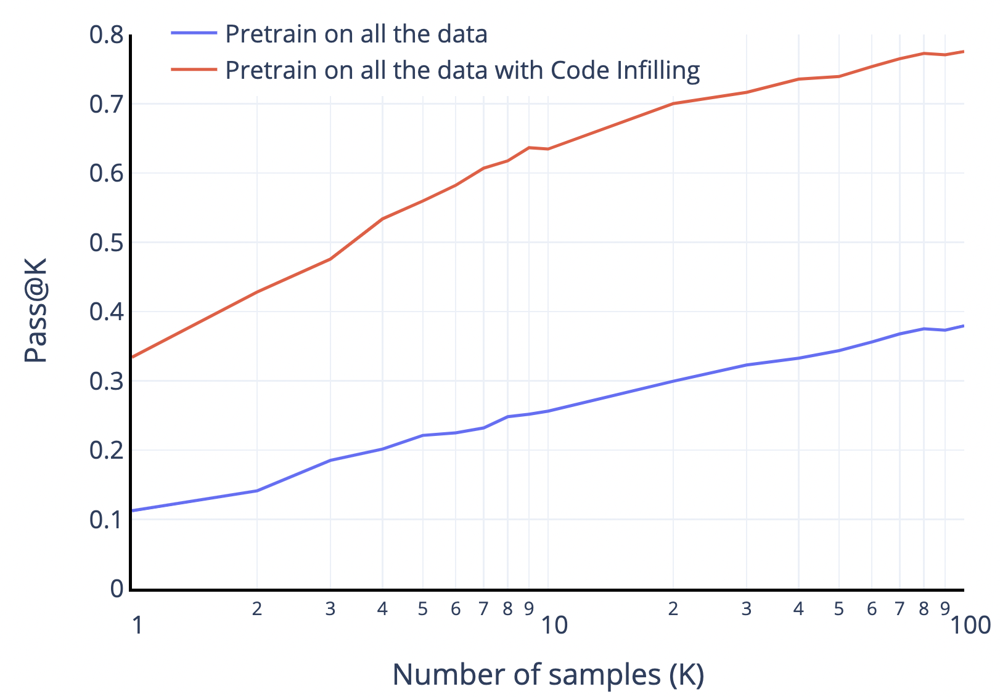
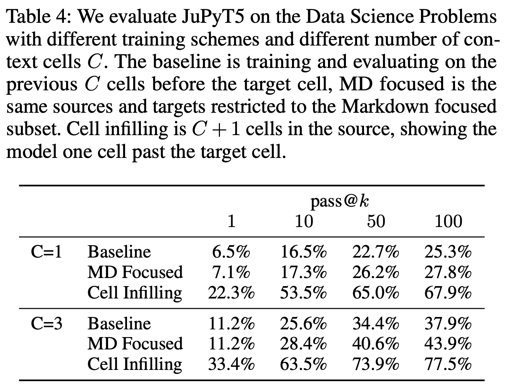
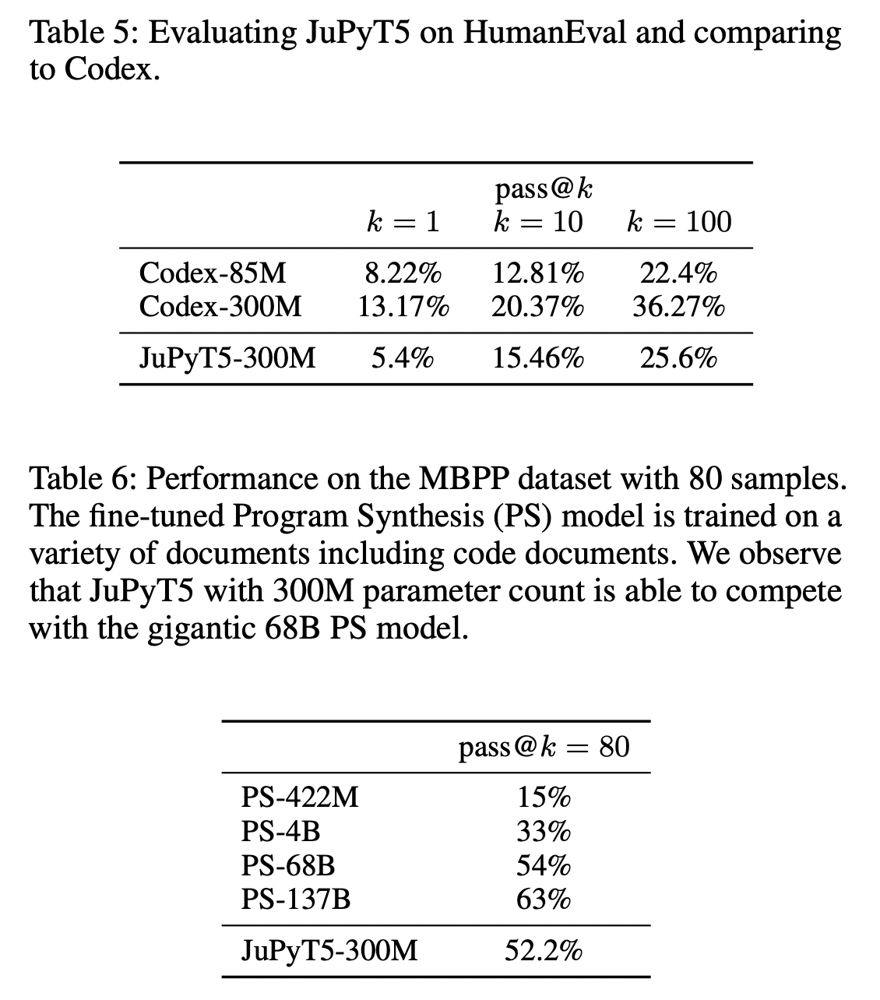

## Training and Evaluating a Jupyter Notebook Data Science Assistant

### Overview

Large Language models like PyMt5 and Codex have been used to generate code from natural language. However, one difficult challenge that remains with generated code is, how to evaluate the functional correctness of the generation? 

Recent works introduced benchmarks, like HumanEval and Mostly Basic Programming Problems (MBPP), consisting of a problem statement, the ground truth code and unit test cases. The generated code is executed against the unit-test cases for evaluation. However, these problems test entry-level programming questions, for example, reverse only the vowels of a given string, find the longest
palindromic subsequence among others. 

In this work, we introduce a benchmark dataset called, Data Science Problems (DSP), a code benchmark, which includes data-science programming tasks such as, implementing the negative log bernoulli loss function in PyTorch, performing string operations on Pandas series after reading a csv file in a DataFrame, and training a machine learning model in scikit-learn. 

### Data Science Problems Dataset

The DSP dataset consists of 1119 data-science problems, along with unit-test cases to evaluate the code generation from language models. The problems in DPS are collected from data-science assignments presented to students in Jupyter Notebooks for various data-science and machine learning courses. Specifically, we used `nbgrader`, a tool used by instructors to create and validate the assignments, to curated student solution notebooks from Github. In total, the DPS is a collection of 306 notebooks with an average of 3.6 problems per notebook, and all are executable with data dependencies in a default Anaconda environment. 

The problems in DSP range from computing gradient backpropagation, performing complex pandas operations on tables to writing and training scikitlearn models. 

### JuPyT5 Model

In the past few years, using machine learning to intelligently autofill and generate text has taken quite a leap. It started with a single word auto-compete on mobile keywords, to entire phrase completion on [GMail's smart compose](https://ai.googleblog.com/2018/05/smart-compose-using-neural-networks-to.html), to [writing an entire narrative fiction using GPT3](https://www.gwern.net/GPT-3) these days. 

A similar trend has been in effect, in the genre of developer productivity tools. It started with a single code token auto-compete using [IntelliSense in VSCode](https://code.visualstudio.com/docs/editor/intellisense), to entire phrase completion using Line Completion [1], to writing an entire method body from natural language description using powerful models like PyMT5 [2] and Codex [3].

Another area in Natural Language Processing, which has seen enormous progress is transfer learning and pre-training strategies. Using an abundant corpus of textual data available on the internet, and training transformer models with different pretraining objectives, has led to huge progress in language understanding. Be it decoder models like GPT predicting the next word, or encoder models like BERT filling in the missing word or sequence-to-sequence models like BART and T5 solving the span masking problem. 

Building upon the shoulders of these giants, we introduce JuPyT5, a model trained for data science code-generation, using a new pretraining objective of code-infilling. The code-infilling objective is fill in the blanks, but applied to a document level instead of word level. Instead of masking out a single word in the corpus, code infilling masks out an entire code block, say a function, and the objective is to predict the missing function given the entire code context. In the example below, the code cell is masked and given the context of data loading, problem statement, and assert statements, JuPyT5 is expected to generate the missing code to replace the string the dataframe column. 

### Benchmark

We evaluate the performance of JuPyT5 on the Data Science Problems benchmark. For each problem, using the code-infilling objective, JuPyT5 is provided with 3 context cells prior to the solution cell and the unit-test in the next cell. A DSP problem is marked passed if and only if the generated code passes the unit test defined in the grading cell below it. We use the pass@k metric to evaluate the unbiased probability of the model correctly solving the problem in k attempts.

When drawing 1 sample, JuPyT5 is able to solve about 33% of all the problems, which about about the same accuracy, when the baseline model is given 100 attempts. Further, we observe that the code-infilling objective in JuPyT5 outperforms the baseline model without the future context, by 40%, when using 100 samples. 

<!-- TODO: Example here -->
<!-- TOTO:  -->

We benchmarked the performance of JuPyT5 on Codex's HumanEval and Program Synthesis's Mostly Basic Programming Problems (MBPP) datasets. HumanEval is a collection of 164 problems, which features Python signatures containing doctest unit tests and natural language docstring descriptions of problems to be solve. Codex beats JuPyT5 on HumanEval except when using a much smaller 85M parameter model. One reason for this performance difference is, the different formatting between markdown cells, which JuPyT5 is trained on, and method docstrings, which Codex is trained on. 

JuPyT5 is able to beat the the Programming Synthesis (PS) model at the MBPP metric for all but their largest model. The PS model is trained mostly on English documents, so this performance gap is not as surprising. 

### Conclusion

<!-- Another challenge with language models preforming code generation is, how do we evaluate these models? Historically generated text from a language model have been evaluated using lexical word overlap using BLEU, ROUGE score. However, it would naive to assume that any form of token overlap metric might be able to successfully evaluate code generation. 

We explore the area of pedagogical learning and how we can assist students and developers alike, solving data science problems. Problems such as manipulating pandas dataframe, translating complex latex equations to code or training a machine learning model. 
 -->

